# TÀI LIỆU BIỂU ĐỒ LỚP CHI TIẾT TOÀN HỆ THỐNG (DETAILED SYSTEM CLASS DIAGRAM - BCE PATTERN)

Tài liệu này chứa biểu đồ lớp mức thiết kế chi tiết cho toàn bộ dự án **PheLaWeb** theo mô hình **Boundary - Control - Entity (BCE)** kết hợp với mẫu **DAO (Data Access Object)**. Sơ đồ mô tả chi tiết các thành phần giao diện (UI), các lớp điều khiển xử lý nghiệp vụ (Control/Manager), các lớp kết nối cơ sở dữ liệu (DAO/Repository) và các lớp thực thể (Entity) với đầy đủ thuộc tính, kiểu dữ liệu, phương thức và các mối quan hệ (Association, Aggregation, Composition) liên kết giữa chúng.

---

## 1. Bản Đồ Phân Phối Lớp (BCE + DAO Class Mapping)

Hệ thống được chia thành 4 phân hệ chính:
1.  **Phân hệ Thành viên & Tài khoản**: Quản lý đăng nhập, thông tin khách hàng, địa chỉ nhận hàng và lịch sử tích lũy điểm.
2.  **Phân hệ Cửa hàng & Thực đơn**: Xem danh sách chi nhánh, lọc danh mục sản phẩm, xem chi tiết sản phẩm và size đi kèm.
3.  **Phân hệ Giỏ hàng & Đặt hàng**: Quản lý giỏ hàng tạm thời, áp dụng mã giảm giá (Voucher), tính toán tiền ship, tạo hóa đơn đơn hàng và thanh toán.
4.  **Phân hệ Tư vấn AI & Khiếu nại**: Hệ thống chatbot AI tự động tư vấn thực đơn qua Gemini API và tiếp nhận ý kiến khiếu nại từ khách hàng.

---

## 2. Sơ đồ Lớp Chi tiết Toàn hệ thống (Mermaid Class Diagram)

```mermaid
classDiagram
    %% Stereotypes Definition & Styling
    classDef boundary fill:#e1f5fe,stroke:#0288d1,stroke-width:2px;
    classDef control fill:#e8f5e9,stroke:#388e3c,stroke-width:2px;
    classDef entity fill:#fff3e0,stroke:#f57c00,stroke-width:2px;
    classDef dao fill:#ede7f6,stroke:#5e35b1,stroke-width:2px;
    classDef actor fill:#fce4ec,stroke:#c2185b,stroke-width:2px;

    %% ---------------------------------------------
    %% ACTORS
    %% ---------------------------------------------
    class Customer_Actor {
        <<Actor>>
    }
    class Admin_Actor {
        <<Actor>>
    }

    %% ---------------------------------------------
    %% BOUNDARY CLASSES (Giao diện & API DTOs)
    %% ---------------------------------------------
    class GiaoDienDangNhap {
        <<Boundary / UI>>
        +usernameInput: String
        +passwordInput: String
        +hienThiGiaoDien() void
        +nutDangNhapClick() void
        +nutDangKyClick() void
    }

    class GiaoDienThanhVien {
        <<Boundary / UI>>
        +thongTinThanhVien: Object
        +danhSachDiaChi: List
        +hienThiThongTin() void
        +nutCapNhatProfileClick() void
        +nutThemDiaChiClick() void
    }

    class GiaoDienCuaHang {
        <<Boundary / UI>>
        +danhSachCuaHang: List
        +danhSachSanPham: List
        +danhMucChon: String
        +hienThiMenu() void
        +nutChonCuaHangClick() void
        +nutLocDanhMucClick() void
    }

    class GiaoDienGioHang {
        <<Boundary / UI>>
        +danhSachItem: List
        +tongTienGioHang: double
        +hienThiGioHang() void
        +nutSuaSoLuongClick() void
        +nutXoaItemClick() void
        +nutThanhToanClick() void
    }

    class GiaoDienDatHang {
        <<Boundary / UI>>
        +voucherCodeInput: String
        +phuongThucThanhToan: String
        +diaChiGiaoHang: String
        +phiShip: double
        +hienThiThanhToan() void
        +nutApDungVoucherClick() void
        +nutXacNhanDatHangClick() void
    }

    class GiaoDienKhungChat {
        <<Boundary / UI>>
        +tinNhanNhap: String
        +danhSachTinNhan: List
        +hienThiKhungChat() void
        +nutGuiTinNhanClick() void
    }

    class GiaoDienKhieuNai {
        <<Boundary / UI>>
        +noiDungKhieuNai: String
        +donHangLienQuan: String
        +hienThiForm() void
        +nutGuiKhieuNaiClick() void
    }

    %% DTOs
    class OrderCreateRequest {
        <<Boundary / DTO>>
        +customerId: String
        +voucherCode: String
        +addressText: String
        +phone: String
        +shippingFee: double
    }

    class OrderResponse {
        <<Boundary / DTO>>
        +orderId: String
        +orderCode: String
        +finalAmount: double
        +status: String
    }

    %% ---------------------------------------------
    %% CONTROL CLASSES (Lớp điều khiển nghiệp vụ)
    %% ---------------------------------------------
    class DieuKhienHeThong {
        <<Control>>
        +xacThucTaiKhoan(String user, String pass) boolean
        +dangKyThanhVien(String user, String email, String pass) boolean
        +truyVanThongTinThanhVien(String customerId) Customer
        +capNhatThongTinProfile(String id, String name, String phone) void
    }

    class DieuKhienCuaHang {
        <<Control>>
        +layDanhSachCuaHang(String city) List~Branch~
        +layThucDonCuaHang(String branchCode) List~Product~
        +timKiemSanPham(String search) List~Product~
    }

    class DieuKhienGioHang {
        <<Control>>
        +layGioHangKhachHang(String customerId) Cart
        +themSanPhamVaoGio(String customerId, String productId, int qty) Cart
        +capNhatSoLuongGio(String customerId, String itemId, int qty) Cart
        +xoaItemKhoiGio(String customerId, String itemId) Cart
    }

    class DieuKhienDonHang {
        <<Control>>
        +tinhToanGiaTriDon(String cartId, String voucherCode) double
        +taoDonHangMoi(String customerId, String cartId, String voucherCode, String address) Order
        +thanhToanDonHang(String orderId, String method) boolean
        +huyDonHang(String orderId) void
    }

    class DieuKhienTuVan {
        <<Control>>
        +xuLyTinNhanAI(String customerId, String text) String
        +layLichSuHoiThoai(String customerId) List~ConversationMessage~
        +ghiNhanKhieuNai(String customerId, String orderId, String content) Complaint
    }

    %% ---------------------------------------------
    %% DAO CLASSES (Data Access Objects)
    %% ---------------------------------------------
    class CustomerDAO {
        <<Interface / DAO>>
        +save(Customer c) void
        +findById(String id) Customer
    }
    class BranchDAO {
        <<Interface / DAO>>
        +save(Branch b) void
        +findByCode(String code) Branch
    }
    class ProductDAO {
        <<Interface / DAO>>
        +save(Product p) void
        +findByCategory(String catCode) List~Product~
    }
    class CartDAO {
        <<Interface / DAO>>
        +save(Cart c) void
        +findByCustomerId(String customerId) Cart
    }
    class OrderDAO {
        <<Interface / DAO>>
        +save(Order o) void
        +findById(String id) Order
    }
    class ConversationDAO {
        <<Interface / DAO>>
        +save(Conversation conv) void
        +findByCustomerId(String customerId) Conversation
    }
    class ComplaintDAO {
        <<Interface / DAO>>
        +save(Complaint comp) void
        +findById(String id) Complaint
    }

    %% ---------------------------------------------
    %% ENTITY CLASSES (Lớp thực thể)
    %% ---------------------------------------------
    class Customer {
        <<Entity>>
        +id: String
        +customerCode: String
        +fullName: String
        +email: String
        +phone: String
        +points: int
        +membershipClass: String
        +created_at: DateTime
    }

    class Address {
        <<Entity>>
        +id: String
        +recipientName: String
        +phone: String
        +detailedAddress: String
        +city: String
        +isDefault: boolean
    }

    class PointHistory {
        <<Entity>>
        +id: String
        +pointsChanged: int
        +actionType: String
        +description: String
        +created_at: DateTime
    }

    class Branch {
        <<Entity>>
        +id: String
        +branchCode: String
        +branchName: String
        +address: String
        +city: String
        +status: String
    }

    class Product {
        <<Entity>>
        +id: String
        +productCode: String
        +productName: String
        +originalPrice: double
        +discountPrice: double
        +isGift: boolean
        +status: String
    }

    class Category {
        <<Entity>>
        +id: String
        +categoryCode: String
        +categoryName: String
        +description: String
    }

    class ProductSize {
        <<Entity>>
        +id: String
        +sizeCode: String
        +priceDifference: double
    }

    class Cart {
        <<Entity>>
        +id: String
        +totalAmount: double
        +updated_at: DateTime
    }

    class CartItem {
        <<Entity>>
        +id: String
        +quantity: int
        +priceAtAdd: double
    }

    class Order {
        <<Entity>>
        +id: String
        +orderCode: String
        +totalAmount: double
        +shippingFee: double
        +finalAmount: double
        +paymentMethod: String
        +paymentStatus: String
        +status: String
        +created_at: DateTime
    }

    class OrderItem {
        <<Entity>>
        +id: String
        +quantity: int
        +priceAtPurchase: double
    }

    class OrderItemTopping {
        <<Entity>>
        +id: String
        +quantity: int
        +priceAtPurchase: double
    }

    class Voucher {
        <<Entity>>
        +id: String
        +voucherCode: String
        +discountValue: double
        +discountType: String
        +minOrderValue: double
        +status: String
    }

    class Conversation {
        <<Entity>>
        +id: String
        +status: String
        +created_at: DateTime
    }

    class ConversationMessage {
        <<Entity>>
        +id: String
        +senderType: String
        +content: String
        +created_at: DateTime
    }

    class Complaint {
        <<Entity>>
        +id: String
        +complaintCode: String
        +content: String
        +status: String
        +created_at: DateTime
    }

    %% ---------------------------------------------
    %% STYLING APPLICATION
    %% ---------------------------------------------
    style Customer_Actor actor
    style Admin_Actor actor
    style GiaoDienDangNhap boundary
    style GiaoDienThanhVien boundary
    style GiaoDienCuaHang boundary
    style GiaoDienGioHang boundary
    style GiaoDienDatHang boundary
    style GiaoDienKhungChat boundary
    style GiaoDienKhieuNai boundary
    style OrderCreateRequest boundary
    style OrderResponse boundary

    style DieuKhienHeThong control
    style DieuKhienCuaHang control
    style DieuKhienGioHang control
    style DieuKhienDonHang control
    style DieuKhienTuVan control

    style CustomerDAO dao
    style BranchDAO dao
    style ProductDAO dao
    style CartDAO dao
    style OrderDAO dao
    style ConversationDAO dao
    style ComplaintDAO dao

    style Customer entity
    style Address entity
    style PointHistory entity
    style Branch entity
    style Product entity
    style Category entity
    style ProductSize entity
    style Cart entity
    style CartItem entity
    style Order entity
    style OrderItem entity
    style OrderItemTopping entity
    style Voucher entity
    style Conversation entity
    style ConversationMessage entity
    style Complaint entity

    %% ---------------------------------------------
    %% RELATIONSHIPS AND CONNECTIONS
    %% ---------------------------------------------
    %% Actors to Boundary UI
    Customer_Actor --> GiaoDienDangNhap : Tương tác
    Customer_Actor --> GiaoDienThanhVien : Tương tác
    Customer_Actor --> GiaoDienCuaHang : Tương tác
    Customer_Actor --> GiaoDienGioHang : Tương tác
    Customer_Actor --> GiaoDienDatHang : Tương tác
    Customer_Actor --> GiaoDienKhungChat : Tương tác
    Customer_Actor --> GiaoDienKhieuNai : Tương tác

    %% Boundary UI to Control Classes
    GiaoDienDangNhap --> DieuKhienHeThong : +Goi xu ly
    GiaoDienThanhVien --> DieuKhienHeThong : +Goi xu ly
    GiaoDienCuaHang --> DieuKhienCuaHang : +Goi xu ly
    GiaoDienGioHang --> DieuKhienGioHang : +Goi xu ly
    GiaoDienDatHang --> DieuKhienDonHang : +Goi xu ly
    GiaoDienKhungChat --> DieuKhienTuVan : +Goi xu ly
    GiaoDienKhieuNai --> DieuKhienTuVan : +Goi xu ly

    %% Control to Entity (Điều phối nghiệp vụ)
    DieuKhienHeThong --> Customer : +Dieu phoi
    DieuKhienCuaHang --> Branch : +Dieu phoi
    DieuKhienCuaHang --> Product : +Dieu phoi
    DieuKhienGioHang --> Cart : +Dieu phoi
    DieuKhienDonHang --> Order : +Dieu phoi
    DieuKhienTuVan --> Conversation : +Dieu phoi
    DieuKhienTuVan --> Complaint : +Dieu phoi

    %% Control to DAO (Truy xuất CSDL)
    DieuKhienHeThong --> CustomerDAO : +Truy xuat
    DieuKhienCuaHang --> BranchDAO : +Truy xuat
    DieuKhienCuaHang --> ProductDAO : +Truy xuat
    DieuKhienGioHang --> CartDAO : +Truy xuat
    DieuKhienDonHang --> OrderDAO : +Truy xuat
    DieuKhienTuVan --> ConversationDAO : +Truy xuat
    DieuKhienTuVan --> ComplaintDAO : +Truy xuat

    %% DAO to Entity (Quản lý)
    CustomerDAO --> Customer : +Quan ly
    BranchDAO --> Branch : +Quan ly
    ProductDAO --> Product : +Quan ly
    CartDAO --> Cart : +Quan ly
    OrderDAO --> Order : +Quan ly
    ConversationDAO --> Conversation : +Quan ly
    ComplaintDAO --> Complaint : +Quan ly

    %% Entity to Entity Relationships
    Customer "1" *-- "0..*" Address : +Co (Danh sach dia chi)
    Customer "1" *-- "0..*" PointHistory : +Lich su (Tich luy diem)
    Customer "1" *-- "0..1" Cart : +So huu (Gio hang tam)
    Customer "1" --> "0..*" Order : +Dat hang (Danh sach don hang)
    Customer "1" *-- "0..*" Conversation : +Lich su chat (Hoi thoai)
    Customer "1" --> "0..*" Complaint : +Gui (Yeu cau ho tro)

    Cart "1" *-- "0..*" CartItem : +Bao gom (Aggregation)
    CartItem "0..*" --> "1" Product : +Chon
    CartItem "0..*" --> "0..1" ProductSize : +Kich thuoc

    Order "1" *-- "0..*" OrderItem : +Chi tiet (Composition)
    Order "0..*" --> "0..1" Address : +Giao toi
    Order "0..*" --> "0..1" Branch : +Xu ly tai
    Order "0..*" --> "0..1" Voucher : +Ap dung
    Order "1" --> "0..*" PointHistory : +Ghi nhan
    Order "1" --> "0..1" Complaint : +Lien quan

    OrderItem "1" *-- "0..*" OrderItemTopping : +Topping (Composition)
    OrderItem "0..*" --> "1" Product : +Mon chinh
    OrderItemTopping "0..*" --> "1" Product : +Mon topping

    Category "1" *-- "0..*" Product : +Phan loai
    Product "1" *-- "0..*" ProductSize : +Co size (Composition)

    Conversation "1" *-- "0..*" ConversationMessage : +Gom (Composition)
```

---

## 3. Mô tả Các Lớp Trong Hệ Thống (Class Descriptions)

### 3.1. Các Lớp Biên (Boundary Layer - UI & API)

*   `GiaoDienDangNhap`: Cho phép khách hàng điền tài khoản, mật khẩu, gửi yêu cầu đăng ký hoặc đăng nhập lên hệ thống.
*   `GiaoDienThanhVien`: Hiển thị thông tin profile khách hàng, điểm tích lũy hiện tại và cho phép cập nhật thông tin cá nhân hoặc quản lý danh sách địa chỉ nhận hàng.
*   `GiaoDienCuaHang`: Hiển thị danh sách các chi nhánh của Phê La và thực đơn đồ uống theo các danh mục sản phẩm (Trà ô long, Cà phê, Topping...).
*   `GiaoDienGioHang`: Hiển thị danh sách các món uống đang được thêm tạm thời trong giỏ hàng, cho phép thay đổi số lượng hoặc xóa bỏ.
*   `GiaoDienDatHang`: Giao diện Checkout, hiển thị thông tin hóa đơn tạm tính, cho phép áp dụng Voucher giảm giá, chọn địa chỉ giao hàng và xác nhận đặt hàng.
*   `GiaoDienKhungChat`: Giao diện chat trực tuyến hỗ trợ khách hàng đặt câu hỏi tư vấn thực đơn cho trợ lý AI Gemini.
*   `GiaoDienKhieuNai`: Biểu mẫu nhập nội dung phản hồi, ý kiến khiếu nại về chất lượng đơn hàng.
*   `OrderCreateRequest` & `OrderResponse`: Các lớp DTO trung gian chịu trách nhiệm đóng gói tham số nhận và dữ liệu phản hồi giữa Client và Server.

### 3.2. Các Lớp Điều Khiển (Control Layer - Managers)

*   `DieuKhienHeThong`: Xử lý logic đăng ký, mã hóa mật khẩu, kiểm tra quyền truy cập đăng nhập và truy xuất thông tin tài khoản thành viên.
*   `DieuKhienCuaHang`: Cung cấp danh sách các chi nhánh đang hoạt động và hỗ trợ chức năng tìm kiếm sản phẩm trong thực đơn.
*   `DieuKhienGioHang`: Thực hiện logic thêm món mới, cập nhật số lượng món uống, hoặc xóa bớt món khỏi giỏ hàng.
*   `DieuKhienDonHang`: Thực hiện các phép tính tiền (tổng tiền món, giảm giá voucher, tính toán phí ship dựa trên khoảng cách địa lý) và quản lý trạng thái của hóa đơn (Đang chuẩn bị, Đang giao, Đã hoàn thành, Đã hủy).
*   `DieuKhienTuVan`: Kết nối với API Trí tuệ Nhân tạo để tạo câu trả lời tự động cho khách hàng, đồng thời hỗ trợ ghi nhận các khiếu nại về đơn hàng.

### 3.3. Các Lớp DAO (Data Access Object - <<DAO>>)

*   `CustomerDAO`, `BranchDAO`, `ProductDAO`, `CartDAO`, `OrderDAO`, `ConversationDAO`, `ComplaintDAO`: Các giao diện (Interface) định nghĩa các phương thức thao tác đọc/ghi cơ sở dữ liệu quan hệ (CRUD) tương ứng với từng thực thể hệ thống.

### 3.4. Các Lớp Thực Thể (Entity Layer - Domain Objects)

*   `Customer`: Chứa thông tin tài khoản khách hàng, số điểm tích lũy và xếp hạng thành viên (Đồng, Bạc, Vàng, Kim Cương).
*   `Address`: Danh sách địa chỉ nhận hàng của khách hàng (mỗi khách hàng có thể có nhiều địa chỉ).
*   `PointHistory`: Lịch sử cộng hoặc tiêu điểm tích lũy của khách hàng mỗi khi đặt đơn mới hoặc đổi quà tặng.
*   `Branch`: Thông tin chi tiết về từng chi nhánh của Phê La (tên cửa hàng, địa chỉ, trạng thái hoạt động).
*   `Product`: Thông tin sản phẩm bao gồm mã, tên món uống, mô tả, giá gốc, giá khuyến mãi và cờ đánh dấu sản phẩm quà tặng.
*   `Category`: Danh mục sản phẩm (ví dụ: "Trà Ô Long", "Bộ sưu tập", "Đồ ăn kèm").
*   `ProductSize`: Các loại size khả dụng của sản phẩm (S, M, L) và giá chênh lệch của mỗi size.
*   `Cart` & `CartItem`: Thông tin giỏ hàng tạm thời và danh sách các món uống được chọn bao gồm số lượng.
*   `Order`: Thông tin đơn đặt hàng chính thức của khách (mã hóa đơn, tổng tiền, phương thức thanh toán, địa chỉ giao hàng và trạng thái đơn hàng).
*   `OrderItem` & `OrderItemTopping`: Chi tiết các món uống trong đơn đặt hàng và danh sách các loại topping đi kèm (như trân châu, kem cheese).
*   `Voucher`: Mã giảm giá có thể áp dụng cho các đơn hàng đủ điều kiện giá trị tối thiểu.
*   `Conversation` & `ConversationMessage`: Lịch sử cuộc trò chuyện tư vấn của khách hàng với Trợ lý ảo AI.
*   `Complaint`: Thông tin chi tiết phản hồi khiếu nại của khách hàng liên quan đến chất lượng đồ uống hoặc thái độ phục vụ.
